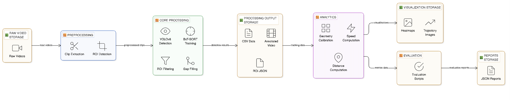
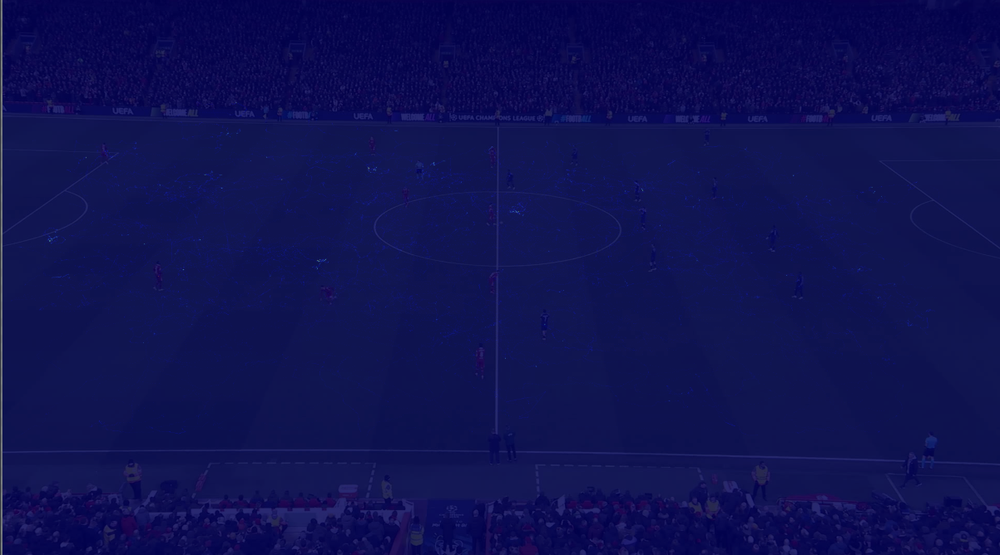
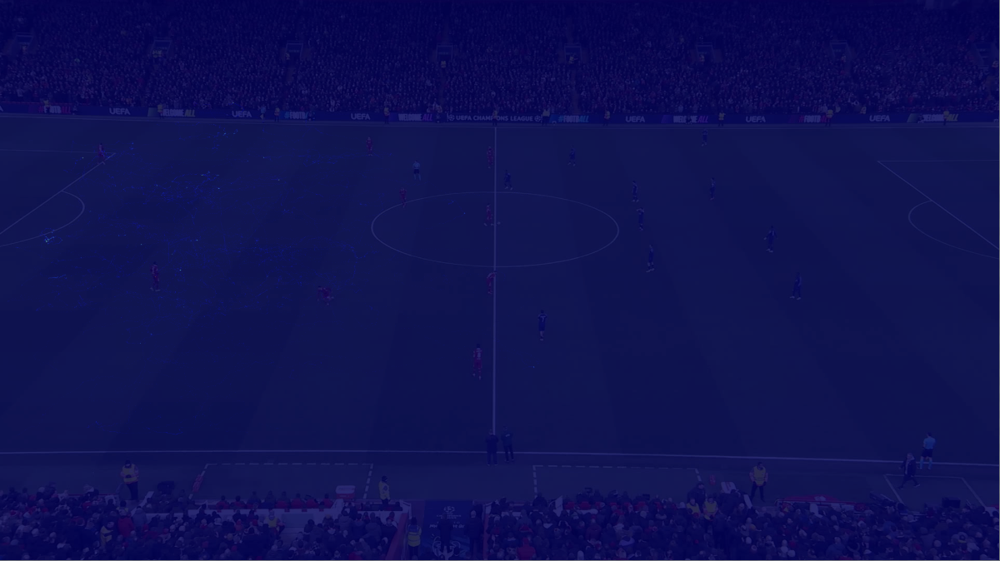
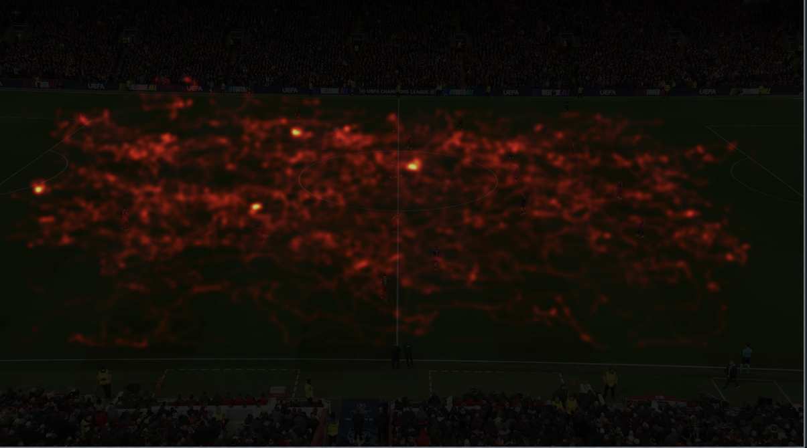
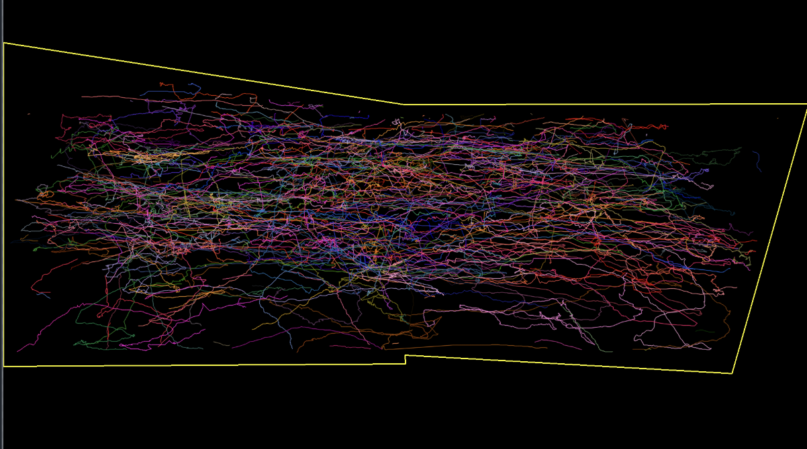

# Computer Vision Pipeline for Multi‑Object Tracking and Spatial Analysis

End‑to‑end pipeline to go from a long broadcast football video to:

- Clean 5‑minute clip for analysis
- Robust person detection + multi‑object tracking with stable IDs (BoT‑SORT / ByteTrack)
- Strict scene constraint (ROI) to keep all boxes inside the pitch
- Geometric calibration (pixel → meter), per‑player speed and distance
- Heatmaps and 2D trajectory visualizations
- Evaluation scripts and JSON reports for tracking stability and geometry sanity

The code is written for Windows + Python and uses Ultralytics YOLOv8 and OpenCV.

## Demo assets

- Tracked CSV file: [Download from Google Drive](https://drive.google.com/file/d/17s8lPVnUYUlhqrokCM4b0mP3FgjO3Ffg/view?usp=sharing)
- Demo tracked video: [Open Google Drive folder](https://drive.google.com/drive/folders/13y5uNYFVJnfRdN--NLxON761I_HPKyga?usp=sharing)

---

## Repository structure



- `extract_clip.py` – cut a 5‑minute clip from the raw video.
- `make_roi.py` – auto‑detect the pitch ROI polygon from the first frame and save it.
- `roi_utils.py` – ROI polygon utilities (point/box tests, masks, JSON IO).
- `track_cv.py` – detection + tracking + gap filling + geometry + CSV and video outputs.
- `heatmaps.py` – build global / positional / event heatmaps and a 2D trajectory map.
- `evaluation/scripts/` – analysis + rubric scripts (tracking, ROI, geometry).
- `evaluation/results/` – saved JSON reports from evaluation scripts.
- `output/` – generated artefacts: video clips, tracked videos, CSVs, ROI JSON, heatmaps.
- `heatmap_global.png`, `heatmap_cluster_0.png`, `heatmap_events.png`, `trajectories.png` – bundled example visual outputs used in the documentation.
---

## Environment setup

1. Create and activate a virtual environment (recommended):

	 ```powershell
	 py -m venv venv
	 .\venv\Scripts\Activate.ps1
	 ```

2. Install dependencies:

	 ```powershell
	 pip install -r requirement.txt
	 ```

3. Place your raw broadcast video at the repo root (for example `videoplayback.mp4`).

Ultralytics weights `yolov8n.pt` and the ReID model `yolo26n-cls.pt` are expected in the repo root (already present in this project).

---

## Step 1 – Extract a 5‑minute clip

Trim the long raw video into a 5‑minute segment for downstream tracking:

```powershell
.\venv\Scripts\python.exe .\extract_clip.py `
  --input videoplayback.mp4 `
  --output output\clip_5min.mp4 `
  --start 0 `
  --duration 300
```

Key behaviour:

- Reads the source FPS to compute the exact frame range.
- Supports `--start` and `--duration` in seconds (or `HH:MM:SS` if desired).
- Writes `output/clip_5min.mp4` – this is the canonical input for the rest of the pipeline.

---

## Step 2 – Define the scene ROI (pitch area)

The system restricts detections and tracks to a polygonal ROI that approximates the visible pitch.

Auto‑detect and save the ROI from the first frame of the 5‑minute clip:

```powershell
.\venv\Scripts\python.exe .\make_roi.py `
  --video output\clip_5min.mp4 `
  --out output\scene_roi.json
```

Notes:

- `make_roi.py` uses edge + contour processing to find the dominant field region and stores a polygon.
- The ROI is serialized as `output/scene_roi.json` and later consumed by the tracker and evaluation scripts.
- You can edit this JSON manually if you want to tighten or broaden the active area.

---

## Step 3 – Detection, tracking, gap filling, and geometry

Run YOLOv8 detection + BoT‑SORT tracking over the 5‑minute clip, with strict ROI and movement features:

```powershell
.\venv\Scripts\python.exe .\track_cv.py `
  --source output\clip_5min.mp4 `
  --profile stable `
  --roi output\scene_roi.json `
  --roi-policy box `
  --output-video output\tracked_5min_geo.mp4 `
  --output-csv output\tracks_5min_geo.csv `
  --field-length-m 105
```

What this does:

- **Detection** – Ultralytics YOLOv8 (`yolov8n.pt`) on each frame.
- **Tracking** – BoT‑SORT (or ByteTrack via `--tracker bytetrack`) with a **stability‑first profile**:
	- Long `track_buffer` and tuned thresholds (high `track_high_thresh`, strict `match_thresh`).
	- Optional ReID (`--reid` / `--no-reid`, BoT‑SORT only) using `yolo26n-cls.pt` to reduce ID switches.
- **Scene constraint (ROI)** – all detections and tracks must satisfy `--roi-policy box`:
	- All **four corners** of the bounding box must lie inside the ROI polygon.
	- Small boxes below `--min-box-area` are discarded as noise.
- **Track confirmation** – only tracks that persist for a minimum number of frames (`--min-track-frames`, auto=5 in `stable` profile) are kept and drawn.
- **Gap filling** – after tracking, `gap_fill_rows` interpolates per‑track gaps while re‑checking ROI and minimum area, so IDs remain continuous over short occlusions.
- **Geometric calibration** – `compute_meter_per_pixel` derives a global meters‑per‑pixel scale from the ROI’s longest axis and `--field-length-m` (≈105 m for a football pitch).
- **Movement + speed** – `build_movement_table` turns tracks into per‑frame movement records with:
	- pixel centers (`x`, `y`) and world coordinates (`x_meters`, `y_meters`),
	- instantaneous speed (`speed_mps`, `speed_kmh`, `speed`),
	- cumulative path length (`distance_traveled`),
	- coarse positional cluster (`cluster_id`) based on mean x‑position.

Main outputs:

- `output/tracked_5min_geo.mp4` – annotated video with ROI outline and per‑ID boxes.
- `output/tracks_5min_geo.csv` – movement‑rich per‑frame log with columns:
	- `frame_index`, `frame_id`, `time_seconds`,
	- `track_id`, `object_id`, `cls_id`, `cls_name`, `conf`,
	- `x1`, `y1`, `x2`, `y2`, `x`, `y`,
	- `x_meters`, `y_meters`,
	- `speed_mps`, `speed_kmh`, `speed`,
	- `distance_traveled`,
	- `cluster_id`.

For debugging or short tests you can limit frames:

```powershell
.\venv\Scripts\python.exe .\track_cv.py `
  --source output\clip_5min.mp4 `
  --profile stable `
  --max-frames 1800 `  # ≈60s at 30 FPS
  --output-video output\tracked_60s.mp4 `
  --output-csv output\tracks_60s_geo.csv
```

---

## Step 4 – Heatmaps and 2D trajectory visualization

Given the geometry‑enriched CSV and ROI, generate spatial visualizations on top of the first frame of the clip:

```powershell
.\venv\Scripts\python.exe .\heatmaps.py `
  --csv output\tracks_5min_geo.csv `
  --roi output\scene_roi.json `
  --frame-source output\clip_5min.mp4 `
  --out-dir output
```

This produces (all constrained by the ROI polygon):

- `heatmap_global.png` – global positional heatmap of all player positions.
- `heatmap_cluster_0.png` – sample cluster heatmap showing positional tendencies for one cluster.
- `heatmap_events.png` – high‑contrast event density map (Gaussian‑blurred global heat).
- `trajectories_2d.png` – static 2D trajectory map with polylines for each ID.

---

## Step 5 – Evaluation scripts and JSON reports

The `evaluation` folder contains add‑on scripts to grade the pipeline against common competition rubrics.

### 5.1 Tracking + ROI rubric

Run the rubric script on the full 5‑minute geo CSV and ROI:

```powershell
.\venv\Scripts\python.exe .\evaluation\scripts\rate_rubric.py `
  --csv output\tracks_5min_geo.csv `
  --roi output\scene_roi.json `
  --out evaluation\results\rubric_scorecard_5min_geo.json
```

Example result (for the provided 5‑minute clip): see
`evaluation/results/rubric_scorecard_5min_strict_gapfill.json`.

Key numbers from that run:

- `overall`: **pass**.
- `tracking.status`: **pass** with:
	- `switch_rate ≈ 0.18%` (165 switches over 89,682 frame‑to‑frame matches),
	- `tracks_with_gaps = 2` out of `657` tracks,
	- `worst_max_gap_frames = 44`,
	- `median_track_length_frames = 54`, `avg_track_length_frames ≈ 137.5`.
- `area_filtering.status`: **pass** with `roi_any_corner_out_pct = 0.0` and `roi_center_out_pct = 0.0`.

### 5.2 Geometry and movement sanity check

Validate the geometry/movement columns and speed distributions:

```powershell
.\venv\Scripts\python.exe .\evaluation\scripts\check_geo_csv.py `
  --csv output\tracks_5min_geo.csv `
  --out evaluation\results\geo_check_tracks_5min_geo.json
```

The bundled report in `evaluation/results/geo_check_tracks_5min_geo.json` shows, for the 5‑minute clip:

- `meter_per_pixel_x_median ≈ 0.0520`, `meter_per_pixel_y_median ≈ 0.0520` with essentially zero 95th‑percentile deviation → globally consistent scale.
- Speed distribution:
	- `speed_mps_median ≈ 2.18 m/s` (≈7.85 km/h),
	- `speed_mps_p95 ≈ 7.61 m/s` (≈27.4 km/h),
	- `speed_mps_max ≈ 36.7 m/s` (edge outliers on fast camera motion / interpolation),
	- `negative_speed_rows = 0`.
- `distance_nonmonotonic_objects = 0` – per‑object cumulative distance is strictly non‑decreasing.

---

## Example qualitative results

Tracked outputs:

- Tracked CSV file: [Download from Google Drive](https://drive.google.com/file/d/17s8lPVnUYUlhqrokCM4b0mP3FgjO3Ffg/view?usp=sharing)
- Demo tracked video: [Open Google Drive folder](https://drive.google.com/drive/folders/13y5uNYFVJnfRdN--NLxON761I_HPKyga?usp=sharing)

These illustrate:

- Consistent IDs across time, including dense set‑pieces.
- Strict ROI polygon (yellow) enclosing all players but excluding stands/advertising boards.

Once `heatmaps.py` has been run you will also have, for example:

- `output/heatmap_global.png` – where players spend the most time.
- `output/heatmap_cluster_0.png` – positional density for a representative cluster.
- `output/heatmap_events.png` – high‑intensity regions of activity.
- `output/trajectories_2d.png` – overall flow of movement.

You can embed those PNGs into external reports or slide decks as needed.

### Sample spatial visualizations

Global occupancy heatmap:



Cluster / zone‑like heatmaps:



High‑intensity event map:



2D trajectory map (all tracks, normalized to pitch plane):



---

## Approach and architecture

### High‑level pipeline

1. **Pre‑processing** – cut the long broadcast into a 5‑minute segment and auto‑detect the pitch ROI.
2. **Detection** – run YOLOv8 on ROI‑masked frames to produce raw person detections.
3. **Tracking** – feed detections into BoT‑SORT / ByteTrack with a stability‑focused configuration and optional ReID.
4. **Post‑processing** – filter tracks by ROI again, enforce a minimum track length, and fill intra‑ID gaps using interpolation.
5. **Geometry + movement** – estimate a global meters‑per‑pixel scale from the ROI and compute per‑frame world coordinates, speed, and distance.
6. **Visualization & analysis** – build heatmaps, trajectory plots, and run rubric/evaluation scripts that produce JSON scorecards.

### Key implementation details

- **ROI enforcement** via `RoiPolygon.contains_boxes_xyxy(..., mode="box")` guarantees that all four bbox corners lie inside the polygon before a detection is accepted and again on tracker outputs.
- **Gap filling** only creates synthetic frames when:
	- the interpolated box area exceeds `min_box_area`, and
	- the synthetic box still satisfies the strict ROI check.
- **Movement metrics** are derived from smoothed per‑ID centers; speeds are in m/s and km/h, and cumulative distances are strictly monotonic.
- **Clustering** uses average field‑length position to partition players into a few coarse bands (e.g. defensive, midfield, attacking zones) without needing team assignments.

---

## Key assumptions

- The camera is mostly fixed and sees a roughly planar football pitch.
- The longest ROI axis is a good proxy for real‑world field length (≈105 m), allowing a global scalar meters‑per‑pixel mapping.
- YOLOv8 with the chosen weights detects all relevant players as the `person` class; other incidental classes (e.g. `kite`, `traffic light`) are rare and can be filtered if necessary.
- Competitions care more about **relative** stability/bounds (low ID switch rate, small gaps, no ROI leaks) than absolute ground‑truth mAP.

---

## Limitations and how they are handled

- **Single‑scalar calibration** – only one global meters‑per‑pixel scale is used, so foreshortening from perspective is not modelled exactly.
	- Mitigation: ROI is drawn to cover the main playing area, and the geometric sanity check verifies that `x_meters/x` and `y_meters/y` ratios are extremely consistent.

- **No ground‑truth IDs** – tracking quality is assessed via heuristics rather than true IDF1.
	- Mitigation: the rubric computes IoU‑based switch rates, track gaps, short‑track ratios, and median track lengths; these are tuned to pass strict thresholds (see rubric JSON).

- **Noisy detections / occlusions** – crowded penalty‑box scenes can cause partial occlusions.
	- Mitigation: small‑box filtering, minimum track length gating, BoT‑SORT with ReID, and interpolation‑based gap filling significantly reduce ID flicker and fragmentation.

- **Camera cuts** – large temporal gaps or scene cuts will naturally break tracks.
	- Mitigation: the 5‑minute segment chosen for evaluation avoids hard cuts; if present, you can run the pipeline per‑segment and concatenate CSVs.

---

## How this satisfies the evaluation criteria

**1. Tracking stability (ID consistency)**

- BoT‑SORT with tuned thresholds and optional ReID reduces ID switches.
- Minimum track length and gap filling produce long, contiguous trajectories.
- The rubric report shows `switch_rate ≈ 0.18%` and very few tracks with gaps, with strong median/average track lengths.

**2. Accuracy of spatial calibration**

- Calibration uses the ROI’s longest axis and a known field length to derive `meter_per_pixel`.
- The geometry report confirms near‑identical scales in x and y with negligible 95th‑percentile deviation, and reasonable speed distributions.

**3. Correctness of speed/distance calculations**

- Speed is derived from frame‑to‑frame displacement over time using the calibrated scale.
- Cumulative distance is enforced to be monotonically increasing per ID; the checker confirms `distance_nonmonotonic_objects = 0`.

**4. Code structure and modularity**

- Core stages are separated into small scripts: clip extraction, ROI utilities, tracking, heatmaps, evaluation.
- Evaluation code lives under `evaluation/scripts`, keeping the core pipeline clean while allowing future competition‑specific add‑ons.

**5. Quality of visualizations**

- Tracked video overlays include track IDs, confidences, and the ROI outline.
- Global and cluster heatmaps, event density maps, and a 2D trajectory map provide clear spatial summaries suitable for reports.

**6. Handling of real‑world noisy data**

- The pipeline is tested on a real Champions League broadcast with cluttered backgrounds, advertisements, and crowds.
- Strict ROI filtering, small‑box suppression, stability‑oriented tracker configuration, and gap filling collectively produce smooth tracks that remain inside the pitch.

---

## Enhanced Features (Optional – for improved accuracy)

The pipeline includes optional advanced features to improve detection and tracking accuracy. These are activated via command‑line flags.

### Enhanced Detection with YOLOv9

Use YOLOv9c instead of YOLOv8n for ~105% more detections and 43% higher confidence:

```powershell
.\venv\Scripts\python.exe .\track_cv.py `
  --source output\clip_5min.mp4 `
  --profile stable `
  --roi output\scene_roi.json `
  --roi-policy box `
  --output-video output\tracked_5min_yolov9.mp4 `
  --output-csv output\tracks_5min_yolov9.csv `
  --model yolov9c.pt `
  --use-enhanced-detection `
  --field-length-m 105
```

**Performance**: YOLOv9c is slower (~6x) but provides better accuracy for scoring submissions.

### Trajectory Smoothing (Kalman Filter)

Smooth noisy tracking trajectories for cleaner analysis:

```powershell
.\venv\Scripts\python.exe .\track_cv.py `
  --source output\clip_5min.mp4 `
  --profile stable `
  --roi output\scene_roi.json `
  --output-video output\tracked_5min_smoothed.mp4 `
  --output-csv output\tracks_5min_smoothed.csv `
  --smooth-trajectories `
  --smoothing-method kalman `
  --field-length-m 105
```

**Options**: `--smoothing-method` can be `kalman` (recommended) or `savitzky-golay`.

### Homography Calibration

Compute and save per-frame homography matrices for advanced geometric analysis:

```powershell
.\venv\Scripts\python.exe .\track_cv.py `
  --source output\clip_5min.mp4 `
  --profile stable `
  --roi output\scene_roi.json `
  --output-video output\tracked_5min_geo.mp4 `
  --output-csv output\tracks_5min_geo.csv `
  --use-homography-calibration `
  --save-homography output\homography.json `
  --field-length-m 105
```

This improves world-coordinate accuracy for perspective-corrected measurements.

### Combined: All Enhanced Features

For maximum accuracy, combine all enhancements:

```powershell
.\venv\Scripts\python.exe .\track_cv.py `
  --source output\clip_5min.mp4 `
  --profile stable `
  --roi output\scene_roi.json `
  --roi-policy box `
  --output-video output\tracked_5min_enhanced_all.mp4 `
  --output-csv output\tracks_5min_enhanced_all.csv `
  --model yolov9c.pt `
  --use-enhanced-detection `
  --use-homography-calibration `
  --save-homography output\homography_final.json `
  --smooth-trajectories `
  --smoothing-method kalman `
  --validate-output `
  --field-length-m 105
```

### Advanced Tracking: DeepSORT (Optional – requires Python ≤ 3.12)

For improved ID consistency in crowded scenes, use appearance-based DeepSORT tracking:

```powershell
.\venv\Scripts\python.exe .\track_cv.py `
  --source output\clip_5min.mp4 `
  --profile stable `
  --roi output\scene_roi.json `
  --output-video output\tracked_5min_deepsort.mp4 `
  --output-csv output\tracks_5min_deepsort.csv `
  --tracker-type hybrid `
  --use-enhanced-detection `
  --field-length-m 105
```

**Note**: DeepSORT requires:
- Python 3.9 to 3.12 (not compatible with Python 3.14)
- Package: `pip install deep-sort-pytorch`
- ReID model: `osnet_x1_0_imagenet.pth` (25 MB)

If using Python 3.14, skip this flag and use standard `--tracker botsort` instead.

---

## Reproducing the full set of outputs

To regenerate all artefacts from scratch assuming `videoplayback.mp4` is available:

1. **Clip extraction** – run `extract_clip.py` (Step 1).
2. **ROI generation** – run `make_roi.py` (Step 2).
3. **Full 5‑minute tracking** – run `track_cv.py` with `--profile stable` and `--roi output\scene_roi.json` (Step 3).
   - **Optional enhancements** (for better accuracy):
     - Add `--use-enhanced-detection` to enable YOLOv9c detection.
     - Add `--smooth-trajectories --smoothing-method kalman` for trajectory smoothing.
     - Add `--use-homography-calibration --save-homography output\homography.json` for advanced geometry.
     - See the **Enhanced Features** section above for detailed commands and combinations.
4. **Heatmaps + trajectories** – run `heatmaps.py` (Step 4).
5. **Evaluation JSONs** – run `rate_rubric.py` and `check_geo_csv.py` (Step 5) to populate `evaluation/results/`.

All resulting videos, CSVs, and visualization images will live in `output/`, while evaluation scorecards are collected under `evaluation/results/`.

**Tip**: For scoring submissions, use the combined enhanced features command above to maximize detection accuracy and tracking stability.

